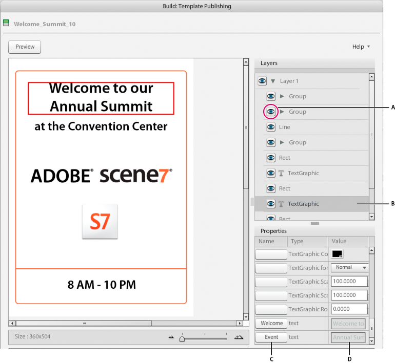

# Parâmetro de um modelo no Dynamic Media Classic{#parameterizing-a-template-in-scene}

Depois de carregar um modelo do Illustrator salvo como FXG clássica do Dynamic Media para o Sistema de publicação Scene 7, você pode definir seus elementos de variável. Faça isso por elementos de variável de diferenciação nas telas de Publicação de modelo e Visualização de telas. O Dynamic Media Classic oferece ferramentas para a definição de parâmetros de texto e objeto em camadas e suas respectivas propriedades. Você também pode criar versões diferentes de um modelo.

O preenchimento de um modelo FXG permite personalizar a variação de texto, imagens e gráficos no modelo. Por exemplo, é possível filtrar uma linha de texto para que os usuários finais possam modificar o texto por meio de uma interface de usuário da Web. É possível definir campos de texto vazios como variáveis para que os usuários finais possam preencher esses campos com texto personalizado. Também é possível filtrar os atributos e as propriedades dos elementos de design na tela de Compilação de modelos de publicação de mídia dinâmica do Dynamic Media.

>[!NOTE]
>
>O modelo do modelo no Dynamic Media Classic não é necessário se você planeja usar a manipulação de DOM.

## Definição de parâmetros em modelos FXG {#defining-parameters-in-fxg-templates}

Siga estas etapas no Dynamic Media Classic para definir parâmetros para um modelo FXG:

1. Na janela Procurar, selecione o arquivo FXG.
1. Clique **em Criar** e escolha **Publicação de modelo** ou clique no botão **Editar** do arquivo.

   A tela Publicação de modelo é aberta.

1. Selecione lrco\ FXG\ Welcome_ Summit_ 10 (arquivo FXG) e clique **em Build** &gt; **Publicação de modelo**.

   

1. No painel Camadas na tela Publicação de modelo, selecione a camada com os elementos que você deseja modificar.

   >[!NOTE]
   >
   >Clique e desative o ícone de olho para selecionar o objeto desejado.

1. No painel Propriedades, clique em um parâmetro na coluna Nome (para formatar texto) ou coluna Parâmetro (para colorir objetos).

   **Clique em Texto** no campo de texto (role até a parte inferior da lista Propriedades para encontrá-la). A caixa de diálogo Parâmetros é exibida. Selecione o texto que deseja modificar e clique **em Adicionar**. É possível criar vários parâmetros a partir da mesma propriedade de texto selecionando partes diferentes do texto e adicionando parâmetros para cada parte. Para alterar o nome do parâmetro, clique nele, insira um novo nome e clique **em Fechar**.

   **Objetos** Clicam em uma caixa na coluna Parâmetro. A caixa de diálogo Editar parâmetro é exibida. Digite um nome e clique **em OK**.

   Para personalizar vários atributos de uma vez com o mesmo valor, use o mesmo nome de parâmetro para cada atributo. Por exemplo, se o modelo tem um retângulo e uma estrela, você pode digitar `newcolor` como o nome do Parâmetro para o atributo de cor solidcolor de cada um. Sempre que você alterar o `newcolor` valor, tanto o retângulo quanto a estrela serão alterados para a nova cor.

1. Especifique um valor padrão para o atributo no campo Valor ou Dados. Defina todas as propriedades do objeto selecionado para especificar a aparência exata desejada.
1. (Opcional) Repita as etapas 3 a 5 para todos os objetos ou camadas que você deseja modificar.
1. Clique **em Salvar** ou **Salvar como**.
1. Clique **em Visualizar** para abrir a janela Visualização FXG e ver os parâmetros criados com seus valores padrão.

## Mostrar ou ocultar um objeto ou uma camada no modelo FXG {#show-or-hide-an-object-or-layer-in-the-fxg-template}

Objetos e camadas ocultos não estão visíveis na visualização ou saída, mas não são excluídos do arquivo. Você pode torná-los visíveis novamente, conforme desejado. Visibilidade é um atributo que você pode fazer variável. Clicar ou desligar o ícone de olho define o valor padrão para a visibilidade de um objeto ou camada.

1. No painel Objetos, clique no ícone de olho próximo a um objeto ou nome de camada para ocultá-lo no arquivo.
1. Clique novamente para tornar o objeto visível.

## Criar versões diferentes de um modelo {#create-different-versions-of-a-template}

É possível editar atributos para criar diferentes versões do modelo para usos diferentes.

Na tela Publicação de modelo, clique em Salvar como para salvar o arquivo como um novo modelo FXG sem substituir o modelo FXG original.

## Uso de texto com traçado {#using-stroked-text}

O texto com traçado é um exemplo de como você pode filtrar os atributos. O Dynamic Media Classic oferece suporte a estes recursos de texto com traçado:

* Largura do traçado
* Padrão de traçado tracejado
* Estilos de junção diferentes
* Estilos finais diferentes
* Superimposição de traçado
* Tratamento de cores separadas para traçado, incluindo suporte a cores spot

Esta tabela descreve os atributos que suportam texto com traçado.

| Atributo | Descrição |
|--- |--- |
| s 7: fill `<Boolean>`(S 7 FXG apenas) | Especifica se o preenchimento está ativado para texto. O padrão é verdadeiro. |
| s 7: stroke `<Boolean>` (somente S 7 FXG) | Especifica se o traço está habilitado para texto. O padrão é false. |
| s 7: weight `<number>` (S 7 FXG somente) | Especifica a espessura do traçado para o texto em pontos. O padrão é 1 ponto. |
| s 7: uniões `<string>` (mitre, arredondadas, bisel) (S 7 FXG somente) | Especifica o tipo de junção do traçado. O padrão é arredondado. |
| s 7: maiúsculas `<string>` (nenhum, arredondado, quadrado) (S 7 FXG somente) | Especifica o tipo de cap do traçado. O padrão é arredondado. |
| s 7: Miterlimit `<number>` (S 7 FXG apenas) | Especifica o limite do mitre quando ingressar em mitre para o traçado. O padrão é 4. |
| s 7: Strokeoverprint `<Boolean>` (somente S 7 FXG) | Especifica se a impressão sobreposta está habilitada para traçado. O padrão é false. |
| s 7: Strokecolorname (S 7 FXG somente) | Igual a s 7: Colorname, exceto que define o nome da cor para o traçado. |
| s 7: Strokecolorvalue (somente S 7 FXG) | Igual a s 7: Colorvalue, exceto que define o valor da cor usada para o traçado. |
| s 7: Strokecolorspace (somente S 7 FXG) | Igual a s 7: espaço de cor, exceto que define o espaço de cor do traçado. |
| flm: Dashpattern `<array>` (somente S 7 FXG) | Por padrão, não há padrões para os traços e lacunas. Esse atributo define o padrão de traço/lacuna do traçado. O primeiro valor é o traço do traçado. A segunda é a diferença entre os traços. É possível estender a matriz para vários valores da mesma maneira que os valores alternativos são especificados como traço e lacuna. |

## Uso de texto distorcido {#using-warped-text}

O texto distorcido permite modificar a aparência do texto com efeitos como onda, sinalizador, esticamento e assim por diante.

O texto distorcido é compatível com objetos richtext. O texto pode ser vertical ou horizontal, e pode ser um texto de ponto, texto da área e texto de tipo a-a. Todo o objeto de texto deve ser selecionado antes que o texto delimitado possa ser aplicado.

O texto distorcido pode ser criado no Adobe Illustrator.

Ao distorcer o texto, você pode definir os seguintes atributos:

* Estilo
* Direção
* Bend
* Distorção horizontal
* Distorção de vértice

Cada atributo contém um conjunto de valores.

| Atributo | Valores | Padrão |
|--- |--- |--- |
| Estilos 7: Warpstyle | Nonearcarclowerarcupperarchbulgeshelllowershellupperflagwavefishrisefisheyeinflatesqueezetwist | none |
| Direções 7: Warpdirection | horizontalvertical | horizontal |
| Bends 7: Warpbend | -1 a 1 | 0.5 |
| Distorções horizontais 7: Warphorizontaldistortion | -1 a 1 | 0 |
| Distorções de verticle 7: Warpverticaldistortion | -1 a 1 | 0 |

>[!NOTE]
>
>Para `inflate` e `fishEye`, alterar `s7:warpDirection` o sinalizador entre horizontal e vertical não afeta a saída.

Para obter mais informações sobre como criar e usar texto distorcido, consulte a documentação do Adobe Illustrator.

>[!MORELIKETHIS]
>
>* [Criar o modelo inicial no Illustrator](create-initial-template-illustrator.md#create_the_initial_template_in_illustrator)
>* [Carregar arquivos para Publicação de modelo](upload-files-template-publishing.md#upload_files_for_template-publishing)

